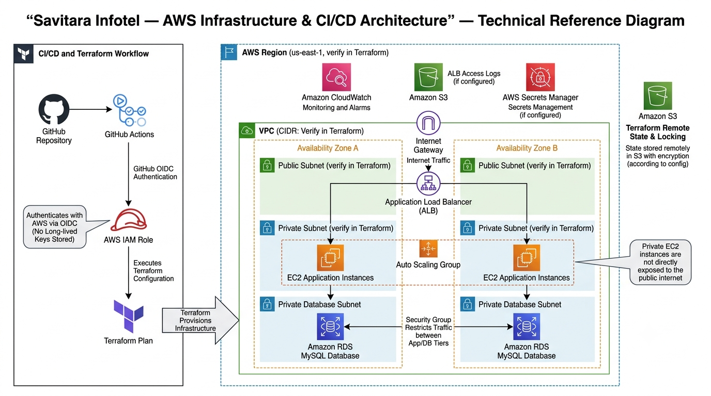

# AWS Infrastructure & CI/CD Automation with Terraform

## Project Overview

This project provisions AWS infrastructure using Terraform and validates infrastructure changes through GitHub Actions.

The infrastructure hosts a web application on private EC2 instances behind an Application Load Balancer, with a private MySQL RDS database and supporting AWS security and logging services.

## Architecture

The architecture diagram illustrates the AWS infrastructure, Terraform provisioning workflow, GitHub Actions CI/CD pipeline, OIDC-based authentication, private application tier, database tier, and supporting AWS services.

**Note:** Verify the diagram against the actual Terraform configuration before submission.

## Architecture Components

* Amazon VPC with CIDR `10.0.0.0/16`
* Two public subnets across two Availability Zones
* Two private application subnets
* Two private database subnets
* Internet Gateway and NAT Gateway
* Application Load Balancer with HTTP listener
* EC2 Auto Scaling Group
* Amazon RDS MySQL database
* AWS Secrets Manager for database credentials
* Amazon S3 for ALB access logs, if configured
* Encrypted S3 remote backend for Terraform state
* GitHub Actions with GitHub OIDC authentication

## Technology Stack

* AWS
* Terraform
* Git and GitHub
* GitHub Actions
* Linux and Ubuntu
* Nginx
* Amazon EC2
* Amazon VPC
* Application Load Balancer
* Auto Scaling
* Amazon RDS MySQL
* Amazon S3
* AWS IAM
* AWS Secrets Manager

## Application Health Check

Health check endpoint:

http://devops-assignment-alb-1867157216.ap-south-1.elb.amazonaws.com/health

Expected response:

OK

Test the endpoint using:

curl -i http://devops-assignment-alb-1867157216.ap-south-1.elb.amazonaws.com/health

A successful health check should return HTTP status `200` with the expected response.

The endpoint and its current status should be verified before submission.

## CI/CD Workflow

The GitHub Actions workflow runs on pushes to the `main` branch and pull requests targeting `main`.

Workflow steps:

1. Check out the repository.
2. Set up Terraform.
3. Authenticate to AWS using GitHub OIDC.
4. Initialize Terraform.
5. Check Terraform formatting.
6. Validate the Terraform configuration.
7. Generate a Terraform plan.

The workflow does not automatically apply infrastructure changes.

## Security Measures

* EC2 instances are configured to run in private application subnets.
* RDS is configured to avoid public accessibility.
* Security groups restrict application and database traffic.
* Database credentials are stored in AWS Secrets Manager, if configured.
* EC2 accesses the database secret through an IAM role, if configured.
* S3 buckets block public access and use encryption, according to their configuration.
* Terraform state is stored in a private, encrypted S3 backend.
* S3 state locking is configured according to the backend implementation.
* GitHub Actions uses OIDC instead of long-lived AWS access keys.
* The GitHub Actions role uses read-only access and additional scoped permissions as required by the workflow.

**IAM note:** AWS managed policies such as ReadOnlyAccess should be reviewed alongside additional permissions to ensure the role follows least-privilege principles.

## Known Limitations

* The ALB currently uses HTTP. HTTPS requires an ACM certificate and HTTPS listener configuration.
* One NAT Gateway is used, so outbound connectivity is not fully redundant across Availability Zones, if this matches the deployed configuration.
* GitHub Actions generates a Terraform plan but does not automatically apply changes.
* AWS resources may incur charges while deployed.
* Availability and redundancy depend on the actual AWS resource configuration.

## Repository Structure

devops-aws-assignment/
├── .github/
│   └── workflows/
│       └── terraform.yml
├── docs/
│   └── aws-architecture.png
├── terraform/
│   ├── backend.tf
│   ├── github-oidc.tf
│   └── *.tf
└── README.md

The exact files and directories may vary depending on the repository layout.

## Cleanup

Review AWS resources after testing or evaluation.

Destroy resources that are no longer required, and review the Terraform destroy plan before confirming.

Do not delete resources needed for demonstration or evaluation.

Before destroying infrastructure, ensure the Terraform state and any required evidence have been preserved.

## Project Status

* AWS infrastructure provisioned using Terraform.
* Application Load Balancer health check previously verified.
* EC2 Auto Scaling Group configured.
* RDS MySQL configured.
* Terraform remote state configured in S3.
* GitHub OIDC authentication configured.
* GitHub Actions workflow successfully executed.
* AWS architecture diagram included in the README, once the PNG is uploaded to the specified path.
